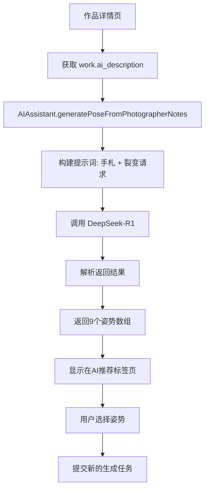

# AI姿势裂变功能 - 更新说明

## 🎯 功能概述

在作品详情页，用户可以基于第一次生成的**摄影师手札**，让AI智能裂变出9个新的拍摄姿势建议。

## 📝 实现逻辑

### 输入
- **摄影师手札** (`work.ai_description`)：第一次AI生成照片时返回的完整文字描述

### 处理流程
```
摄影师手札
    ↓
"以上是摄影师的手札，我希望你根据手札裂变出9个姿势"
    ↓
DeepSeek-R1 AI模型
    ↓
9个姿势建议
```

### 提示词设计
**极简设计，无系统提示词**，只发送用户消息：
```
{摄影师手札的完整内容}

以上是摄影师的手札，我希望你根据手札裂变出9个姿势
```

## 🔧 技术实现

### 1. AIAssistant 新增方法 (`miniprogram/utils/aiAssistant.js`)

```javascript
/**
 * 姿势裂变 - 基于摄影师手札生成新姿势
 * @param {String} photographerNotes - 摄影师手札（第一次生成的完整描述）
 * @param {Number} count - 生成数量（默认9个）
 * @returns {Promise<Array>} 姿势建议数组
 */
async generatePoseFromPhotographerNotes(photographerNotes, count = 9)
```

**特点：**
- ✅ 无复杂的系统提示词
- ✅ 直接基于手札内容
- ✅ 默认生成9个姿势
- ✅ 使用 DeepSeek-R1 模型

### 2. 作品详情页调用 (`miniprogram/pages/work-detail/work-detail.js`)

```javascript
async generateAIPoseVariations() {
  const work = this.data.work

  // 检查是否有摄影师手札
  if (!work || !work.ai_description) {
    wx.showToast({ title: '暂无摄影师手札', icon: 'none' })
    return
  }

  // 调用AI基于摄影师手札生成9个姿势
  const poses = await aiAssistant.generatePoseFromPhotographerNotes(work.ai_description, 9)

  this.setData({
    aiGeneratedPoses: poses,
    aiLoading: false
  })
}
```

## 📱 用户交互流程

1. **进入作品详情页**
   - 查看第一次生成的作品
   - 看到"摄影师说"区域显示手札内容

2. **点击"姿势裂变"按钮**
   - 打开姿势选择弹窗
   - 自动调用AI生成9个姿势建议

3. **查看AI生成的姿势**
   - 在"AI推荐"标签页
   - 显示9个姿势建议
   - 每个姿势都基于原手札的风格和场景

4. **选择并确认**
   - 点击选中某个姿势
   - 确认后提交新的生成任务

## 🎨 示例

### 输入（摄影师手札）
```
这是一张商务女性摄影作品。画面中，一位优雅的亚洲女性模特身着深蓝色西装外套和白色衬衫，
展现出专业而自信的气质。她自然站立在现代办公室环境中，柔和的自然光从落地窗倾泻而入，
营造出温暖而明亮的氛围。模特的姿势端庄得体，一手自然下垂，另一手轻扶腰间，眼神平视镜头，
流露出从容的微笑。整体画面简约大方，背景虚化处理让主体更加突出。
```

### 提示词
```
这是一张商务女性摄影作品。画面中，一位优雅的亚洲女性模特身着深蓝色西装外套和白色衬衫，
展现出专业而自信的气质。她自然站立在现代办公室环境中，柔和的自然光从落地窗倾泻而入，
营造出温暖而明亮的氛围。模特的姿势端庄得体，一手自然下垂，另一手轻扶腰间，眼神平视镜头，
流露出从容的微笑。整体画面简约大方，背景虚化处理让主体更加突出。

以上是摄影师的手札，我希望你根据手札裂变出9个姿势
```

### 输出（9个姿势建议）
```
1. 双手自然交叉于身前，身体微微侧转，眼神望向远方，展现思考状态
2. 单手轻抚头发，身体呈S形曲线，眼神温柔注视镜头
3. 双手插入西装口袋，重心放在一侧腿，展现随性自信
4. 一手扶着办公桌，身体侧倾，回眸微笑
5. 双臂自然下垂，抬头仰视45度，表现出积极向上的姿态
6. 单手轻托下巴，坐姿优雅，展现知性气质
7. 转身回眸，手部自然摆动，捕捉动态美感
8. 双手轻握文件夹，站姿端正，专注的眼神
9. 微微低头整理衣袖，侧面轮廓清晰，展现细节之美
```

## 🚀 优势

1. **极简设计**：无复杂系统提示词，AI根据手札自然理解
2. **保持一致性**：生成的姿势会自动延续原手札的风格、场景、服装
3. **智能推理**：DeepSeek-R1 会分析手札中的场景、服装、氛围，生成合适的姿势
4. **用户友好**：用户无需手动输入任何参数，一键生成

## 📊 数据流



## ⚙️ 配置

- **AI模型**：DeepSeek-R1
- **生成数量**：9个姿势
- **缓存时间**：30分钟（AIAssistant 默认）
- **失败重试**：无自动重试，用户可手动点击重新生成

## 🔍 调试信息

启用控制台日志查看：
```javascript
console.log('🎭 基于摄影师手札生成9个姿势建议')
console.log('📝 手札内容:', work.ai_description.substring(0, 100) + '...')
console.log(`✅ 成功生成${poses.length}个姿势建议`)
```

## 📅 更新日志

### 2025-01-XX
- ✅ 简化提示词设计，移除复杂的系统提示词
- ✅ 改为基于摄影师手札生成姿势
- ✅ 默认生成数量从5个增加到9个
- ✅ 移除对 work.parameters 的依赖
- ✅ 标记旧方法 generatePoseVariations 为已弃用

## 🎯 未来优化方向

1. **流式显示**：姿势生成时实时显示，提升用户体验
2. **姿势预览**：为每个姿势生成缩略图预览
3. **历史记录**：保存用户选择过的姿势，方便复用
4. **个性化**：根据用户偏好调整生成风格
