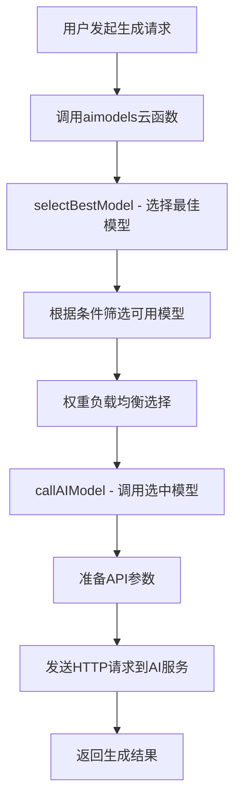

# 🤖 多模态AI模型管理系统使用指南

## 📋 系统概述

AI摄影师小程序现已支持**多模态大模型动态管理**，您可以在数据库中自由添加、删除和配置各种AI模型，系统会自动适配并智能选择最佳模型进行图像生成。

## 🎯 核心特性

### ✅ 多模态模型支持
- **文本到图像** (text-to-image)
- **图像到图像** (image-to-image) 
- **图像变换** (image-variation)
- **可扩展支持更多模态**

### ✅ 主流AI服务商适配
- **Stability AI** - Stable Diffusion系列
- **OpenAI** - DALL-E系列
- **Midjourney** - 创意图像生成
- **Black Forest Labs** - Flux系列
- **支持自定义服务商**

### ✅ 智能模型选择
- **优先级排序**: 按重要程度排序
- **权重负载均衡**: 智能分配请求
- **能力匹配**: 根据需求自动选择合适模型
- **成本控制**: 支持成本预算限制

## 🔧 使用方法

### 1. 添加新AI模型

#### 方法一：通过数据库直接添加
在云开发控制台的`ai_models`集合中按以下格式添加：

```javascript
{
  _id: "model_your_custom_model",
  name: "您的自定义模型",
  provider: "your-provider",
  model_type: "text-to-image",
  capabilities: ["text-to-image", "image-to-image"],
  api_config: {
    endpoint: "https://api.your-service.com/generate",
    headers: {
      "Authorization": "Bearer {{API_KEY}}",
      "Content-Type": "application/json"
    },
    request_format: "json",
    method: "POST"
  },
  parameters: {
    default: {
      width: 1024,
      height: 1024,
      steps: 30,
      guidance_scale: 7.5
    },
    supported: {
      width: [512, 768, 1024, 1152],
      height: [512, 768, 1024, 1152],
      steps: { min: 10, max: 50 },
      guidance_scale: { min: 1, max: 20 }
    }
  },
  pricing: {
    cost_per_image: 0.02,
    currency: "USD"
  },
  is_active: true,
  priority: 8,
  weight: 6,
  created_at: new Date(),
  updated_at: new Date()
}
```

#### 方法二：通过管理页面添加
1. 访问 `/pages/admin-models/admin-models` 页面
2. 点击"添加模型"按钮
3. 填写模型信息
4. 确认添加

### 2. 模型配置说明

#### 必需字段
- `name`: 模型显示名称
- `provider`: 服务提供商标识
- `model_type`: 模型类型
- `api_config`: API调用配置

#### 可选字段
- `capabilities`: 支持的功能列表
- `parameters`: 参数配置
- `pricing`: 定价信息
- `priority`: 优先级 (1-10)
- `weight`: 权重 (1-10)
- `is_active`: 是否启用

### 3. API配置适配

#### Stability AI 格式
```javascript
api_config: {
  endpoint: "https://api.stability.ai/v1/generation/stable-diffusion-xl-1024-v1-0/text-to-image",
  headers: {
    "Authorization": "Bearer {{API_KEY}}",
    "Content-Type": "application/json"
  }
}
```

#### OpenAI 格式
```javascript
api_config: {
  endpoint: "https://api.openai.com/v1/images/generations",
  headers: {
    "Authorization": "Bearer {{API_KEY}}",
    "Content-Type": "application/json"
  }
}
```

#### 自定义服务格式
```javascript
api_config: {
  endpoint: "https://your-custom-api.com/generate",
  headers: {
    "X-API-Key": "{{API_KEY}}",
    "Content-Type": "application/json",
    "User-Agent": "AI-Photographer/1.0"
  }
}
```

## 🎮 系统工作流程

### 图像生成流程


### 模型选择逻辑
1. **筛选条件匹配**: 根据模型类型、能力需求筛选
2. **成本控制**: 过滤超出预算的模型
3. **优先级排序**: 按priority字段排序
4. **权重负载均衡**: 按weight字段进行加权随机选择
5. **故障转移**: 失败时自动尝试其他模型

## 🛠️ 高级功能

### 1. 动态模型管理

#### 启用/禁用模型
```javascript
// 通过API调用
await api.toggleAIModelStatus(modelId, true/false)

// 或直接修改数据库
db.collection('ai_models').doc(modelId).update({
  data: { is_active: false }
})
```

#### 调整优先级和权重
```javascript
await api.updateAIModel(modelId, {
  priority: 9,  // 提高优先级
  weight: 8     // 增加权重分配
})
```

### 2. 智能模型选择

#### 按需求选择
```javascript
// 选择支持特定功能的模型
const result = await api.selectBestAIModel(
  'text-to-image',                    // 模型类型
  ['text-to-image', 'image-to-image'], // 必需能力
  0.05,                               // 最大成本
  ['stability-ai', 'openai']          // 偏好提供商
)
```

#### 成本优化选择
```javascript
// 预算控制
const result = await api.selectBestAIModel(
  'text-to-image',
  [],
  0.02,  // 最大每张0.02美元
  []
)
```

### 3. 性能监控

#### 查看模型使用统计
系统自动记录每次API调用的日志，包括：
- 使用的模型
- 调用是否成功
- 响应时间
- 生成成本

#### 健康检查
```javascript
// 测试模型可用性
await api.callCloudFunction('aimodels', {
  action: 'callAIModel',
  model_id: 'your_model_id',
  prompt: 'test prompt',
  parameters: { count: 1 }
})
```

## 📊 预置模型配置

系统预置了以下主流AI模型：

| 模型名称 | 提供商 | 类型 | 优先级 | 状态 |
|---------|--------|------|--------|------|
| Stable Diffusion XL | Stability AI | text-to-image | 10 | ✅ 启用 |
| DALL-E 3 | OpenAI | text-to-image | 9 | ✅ 启用 |
| Midjourney | Midjourney | text-to-image | 8 | ✅ 启用 |
| Flux.1 Dev | Black Forest Labs | text-to-image | 7 | ✅ 启用 |

## 🔐 权限管理

### 管理员权限
- 添加、删除、修改AI模型
- 调整模型优先级和权重
- 查看模型使用统计
- 测试模型可用性

### 普通用户权限
- 查看可用模型列表
- 使用系统自动选择的模型进行生成

### 权限配置
在云函数环境变量中设置管理员用户：
```
ADMIN_USERS=user_openid_1,user_openid_2,user_openid_3
```

## 🚀 最佳实践

### 1. 模型配置建议
- **优先级**: 按模型质量和可靠性设置 (1-10)
- **权重**: 按模型性能和成本设置 (1-10)
- **成本控制**: 合理设置pricing信息
- **备用方案**: 确保至少有2-3个启用的模型

### 2. 性能优化
- **定期检查**: 监控模型响应时间和成功率
- **负载均衡**: 合理分配权重避免单点压力
- **故障恢复**: 及时禁用不稳定的模型
- **成本控制**: 根据预算调整模型选择策略

### 3. 扩展建议
- **新模型集成**: 按照标准格式添加新的AI服务
- **参数优化**: 根据业务需求调整默认参数
- **监控告警**: 实现模型故障自动告警
- **A/B测试**: 对比不同模型的生成效果

## 📝 总结

通过多模态AI模型管理系统，您可以：

✅ **灵活管理**: 在数据库中自由添加、删除AI模型  
✅ **智能选择**: 系统根据需求自动选择最佳模型  
✅ **成本控制**: 支持预算限制和成本优化  
✅ **高可用性**: 多模型备份和故障转移  
✅ **易于扩展**: 标准化接口支持各种AI服务  

这个系统让您的AI摄影师小程序具备了强大的多模态AI适配能力，可以轻松集成各种最新的AI模型服务！🎉