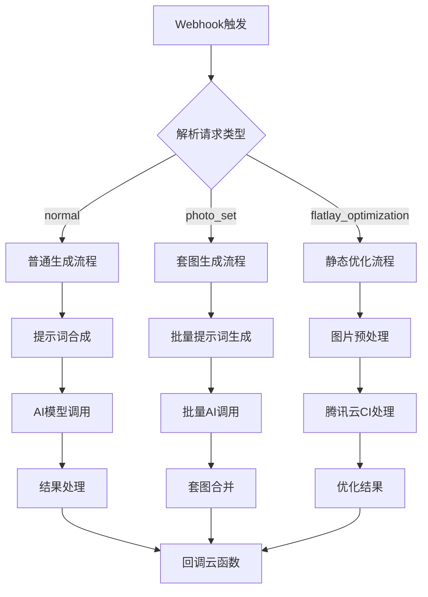
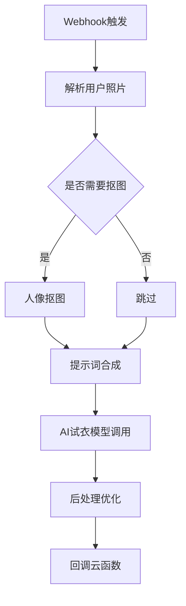
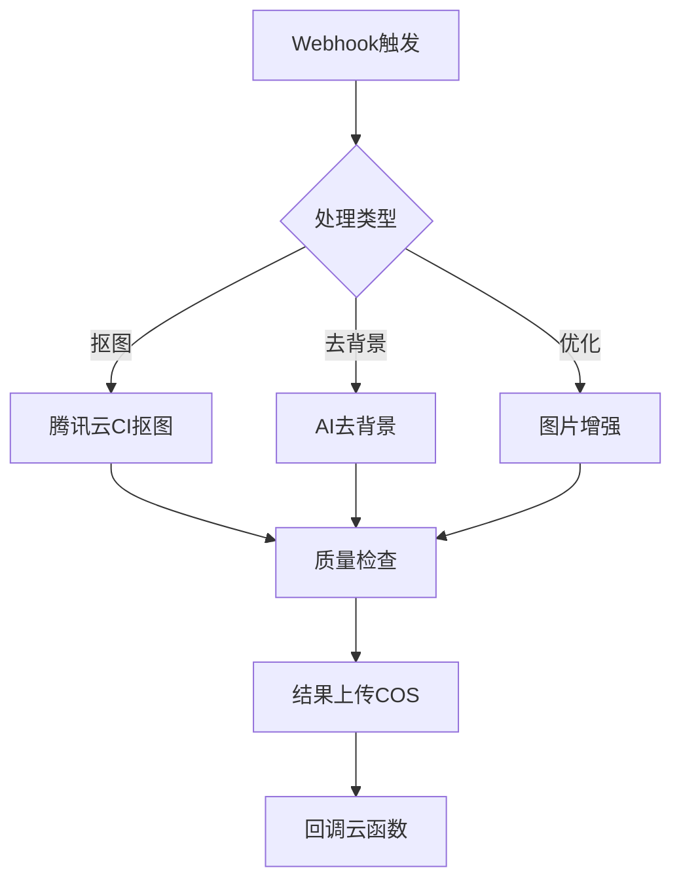

# AI摄影小程序 - n8n工作流架构设计

## 📋 目录
1. [整体架构](#整体架构)
2. [工作流设计](#工作流设计)
3. [提示词合成引擎](#提示词合成引擎)
4. [多智能体协同](#多智能体协同)
5. [任务队列管理](#任务队列管理)
6. [具体实现](#具体实现)

---

## 🏗️ 整体架构

### 系统架构图

```
┌─────────────────┐
│  微信小程序      │
│  (前端)         │
└────────┬────────┘
         │ HTTP请求
         ↓
┌─────────────────┐
│  云函数/API网关  │  ← 路由层
│  (腾讯云)       │
└────────┬────────┘
         │ Webhook
         ↓
┌─────────────────────────────────────────┐
│            n8n 工作流引擎                │
│  ┌──────────────────────────────────┐  │
│  │  1. 任务接收与解析                │  │
│  │  2. 提示词合成引擎                │  │
│  │  3. 多智能体协同调度              │  │
│  │  4. 任务队列管理                  │  │
│  │  5. 结果处理与回调                │  │
│  └──────────────────────────────────┘  │
└────┬────────┬────────┬────────┬────────┘
     │        │        │        │
     ↓        ↓        ↓        ↓
┌─────┐  ┌─────┐  ┌─────┐  ┌─────┐
│AI模型│  │腾讯云│  │数据库│  │存储│
│ API │  │  CI │  │MongoDB│  │COS│
└─────┘  └─────┘  └─────┘  └─────┘
```

---

## 🔄 工作流设计

### 主工作流分类

#### 1. **服装摄影工作流** (`photography-workflow`)

**触发条件：**
- 云函数调用 `photography` 云函数
- mode: `normal` 或 `photo_set` 或 `flatlay_optimization`

**工作流节点：**



#### 2. **试衣间工作流** (`fitting-workflow`)

**触发条件：**
- 云函数调用 `fitting` 云函数

**工作流节点：**



#### 3. **图片处理工作流** (`image-processing-workflow`)

**触发条件：**
- 抠图、去背景、优化等单一图片处理任务

**工作流节点：**



---

## 📝 提示词合成引擎

### 设计理念

提示词合成采用**模板化+动态组装**的方式，根据用户输入参数自动生成专业的AI提示词。

### 提示词模板结构

```javascript
// 提示词模板配置
const PROMPT_TEMPLATES = {
  // 服装摄影模板
  photography: {
    base: "Professional fashion photography of {clothing_description}",

    // 模特参数模板
    model: {
      gender_female: "Beautiful Asian female model, age {age}, height {height}cm",
      gender_male: "Handsome Asian male model, age {age}, height {height}cm",
      nationality: {
        asian: "Asian",
        european: "European",
        african: "African",
        american: "American"
      },
      skin_tone: {
        fair: "fair skin",
        medium: "medium skin tone",
        dark: "dark skin"
      }
    },

    // 场景模板
    scene: {
      studio: "in professional photo studio, white background, studio lighting",
      outdoor: "outdoor natural light, {location}",
      urban: "urban street photography style, {location}"
    },

    // 姿势模板
    pose: {
      standing: "standing pose, full body shot",
      sitting: "sitting elegantly",
      walking: "walking naturally",
      dynamic: "dynamic pose with movement"
    },

    // 灯光模板
    lighting: {
      natural: "natural daylight, soft shadows",
      studio: "professional studio lighting, three-point lighting",
      golden_hour: "golden hour sunset light, warm tone",
      dramatic: "dramatic lighting with strong contrast"
    },

    // 质量后缀
    quality: "high quality, professional photography, 8K resolution, sharp focus, detailed"
  },

  // 静态拍摄模板
  flatlay: {
    base: "Professional product photography of {clothing_description}",
    flatlay: "flat lay on white background, top view, perfectly aligned",
    hanging: "hanging on hanger, white background, front view",
    optimization: {
      removeBackground: "pure white background, no shadows",
      smoothWrinkles: "perfectly smooth fabric, wrinkle-free",
      adjustLighting: "evenly lit, no hotspots",
      enhanceColor: "vibrant colors, color accurate"
    }
  },

  // 试衣间模板
  fitting: {
    base: "Virtual try-on result: person wearing {clothing_description}",
    natural: "natural fit, realistic draping",
    details: "detailed fabric texture, accurate color matching"
  }
}
```

### 提示词合成逻辑（n8n Function节点）

```javascript
// n8n Function节点代码
function composePrompt(params) {
  const {
    mode,
    parameters,
    sceneId,
    clothingImages,
    photoSetConfig
  } = params;

  // 基础提示词
  let prompt = "";

  // 根据模式选择模板
  if (mode === 'normal' || mode === 'photo_set') {
    // 服装描述
    const clothingDesc = parameters.outfit_description || "elegant clothing";
    prompt = PROMPT_TEMPLATES.photography.base.replace('{clothing_description}', clothingDesc);

    // 模特参数
    const gender = parameters.gender || 'female';
    const modelTemplate = PROMPT_TEMPLATES.photography.model[`gender_${gender}`];
    const modelPrompt = modelTemplate
      .replace('{age}', parameters.age || 25)
      .replace('{height}', parameters.height || 170);

    // 国籍和肤色
    const nationality = PROMPT_TEMPLATES.photography.model.nationality[parameters.nationality || 'asian'];
    const skinTone = PROMPT_TEMPLATES.photography.model.skin_tone[parameters.skin_tone || 'medium'];

    prompt += `, ${modelPrompt}, ${nationality}, ${skinTone}`;

    // 场景
    const location = parameters.location || '';
    if (location.includes('室外') || location.includes('户外')) {
      prompt += `, ${PROMPT_TEMPLATES.photography.scene.outdoor.replace('{location}', location)}`;
    } else if (location.includes('街') || location.includes('城市')) {
      prompt += `, ${PROMPT_TEMPLATES.photography.scene.urban.replace('{location}', location)}`;
    } else {
      prompt += `, ${PROMPT_TEMPLATES.photography.scene.studio}`;
    }

    // 姿势
    if (parameters.pose_type) {
      const poseKey = detectPoseType(parameters.pose_type);
      prompt += `, ${PROMPT_TEMPLATES.photography.pose[poseKey] || parameters.pose_type}`;
    }

    // 灯光
    if (parameters.lighting_style) {
      const lightingKey = detectLightingType(parameters.lighting_style);
      prompt += `, ${PROMPT_TEMPLATES.photography.lighting[lightingKey] || parameters.lighting_style}`;
    }

    // 补充参数
    if (parameters.mood_and_atmosphere) {
      prompt += `, ${parameters.mood_and_atmosphere}`;
    }

    // 质量后缀
    prompt += `, ${PROMPT_TEMPLATES.photography.quality}`;

  } else if (mode === 'flatlay_optimization') {
    // 静态拍摄
    const clothingDesc = extractClothingFromImage(clothingImages[0]);
    prompt = PROMPT_TEMPLATES.flatlay.base.replace('{clothing_description}', clothingDesc);

    // 拍摄方式
    const flatlayMode = params.flatlayConfig.mode || 'flatlay';
    prompt += `, ${PROMPT_TEMPLATES.flatlay[flatlayMode]}`;

    // 优化选项
    const optimizations = params.flatlayConfig.optimization;
    Object.keys(optimizations).forEach(key => {
      if (optimizations[key]) {
        prompt += `, ${PROMPT_TEMPLATES.flatlay.optimization[key]}`;
      }
    });

  } else if (mode === 'fitting') {
    // 试衣间
    prompt = PROMPT_TEMPLATES.fitting.base.replace('{clothing_description}', '服装');
    prompt += `, ${PROMPT_TEMPLATES.fitting.natural}`;
    prompt += `, ${PROMPT_TEMPLATES.fitting.details}`;
  }

  return {
    prompt: prompt,
    negative_prompt: "low quality, blurry, distorted, unrealistic, bad anatomy, watermark"
  };
}

// 辅助函数：检测姿势类型
function detectPoseType(poseText) {
  if (poseText.includes('站') || poseText.includes('standing')) return 'standing';
  if (poseText.includes('坐') || poseText.includes('sitting')) return 'sitting';
  if (poseText.includes('走') || poseText.includes('walking')) return 'walking';
  return 'dynamic';
}

// 辅助函数：检测灯光类型
function detectLightingType(lightingText) {
  if (lightingText.includes('自然') || lightingText.includes('natural')) return 'natural';
  if (lightingText.includes('影棚') || lightingText.includes('studio')) return 'studio';
  if (lightingText.includes('黄昏') || lightingText.includes('golden')) return 'golden_hour';
  return 'natural';
}

// 执行
return composePrompt($input.all()[0].json);
```

---

## 🤖 多智能体协同

### 智能体分工策略

#### Agent 1: **提示词优化智能体** (Prompt Optimizer)
**职责：**
- 分析用户输入
- 优化和补全提示词
- 确保提示词符合AI模型要求

**使用场景：**
- 用户输入的自定义提示词
- 场景描述不够详细时

**实现：**
```javascript
// n8n中调用OpenAI/Claude
{
  "model": "gpt-4",
  "messages": [
    {
      "role": "system",
      "content": "你是专业的时尚摄影提示词优化专家。用户会给你一个简单的描述，你需要将其扩展为专业的摄影提示词。"
    },
    {
      "role": "user",
      "content": "优化这个提示词：${userInput}"
    }
  ]
}
```

#### Agent 2: **图片分析智能体** (Image Analyzer)
**职责：**
- 分析上传的服装图片
- 识别服装类型、颜色、风格
- 提供场景推荐

**使用场景：**
- 用户上传图片但没有描述
- 自动套图生成

**实现：**
```javascript
// 调用视觉模型API (GPT-4 Vision / Claude Vision)
{
  "model": "gpt-4-vision-preview",
  "messages": [
    {
      "role": "user",
      "content": [
        {
          "type": "text",
          "text": "分析这件服装的类型、颜色、风格、材质，并推荐3个适合的拍摄场景。以JSON格式返回。"
        },
        {
          "type": "image_url",
          "image_url": "${clothingImageUrl}"
        }
      ]
    }
  ]
}
```

#### Agent 3: **质量检查智能体** (Quality Inspector)
**职责：**
- 检查生成结果质量
- 识别瑕疵和问题
- 决定是否需要重新生成

**使用场景：**
- 生成完成后的质量把关
- 自动重试机制

**实现：**
```javascript
// 检查逻辑
async function checkQuality(generatedImageUrl) {
  // 1. 调用视觉模型检查
  const analysis = await analyzeImage(generatedImageUrl);

  // 2. 质量评分
  const qualityScore = {
    clarity: analysis.clarity_score,        // 清晰度
    composition: analysis.composition_score, // 构图
    lighting: analysis.lighting_score,      // 光线
    realism: analysis.realism_score         // 真实性
  };

  // 3. 综合判断
  const avgScore = Object.values(qualityScore).reduce((a, b) => a + b) / 4;

  return {
    pass: avgScore >= 0.7,
    score: qualityScore,
    issues: analysis.detected_issues
  };
}
```

#### Agent 4: **套图编排智能体** (Photo Set Composer)
**职责：**
- 根据套图模板生成多个提示词
- 确保套图风格一致性
- 镜头分配和优先级

**使用场景：**
- 一键套图生成

**实现：**
```javascript
function composeShotPrompts(template, basePrompt) {
  const shots = template.shots; // ['正面白底', '背面白底', ...]
  const prompts = [];

  shots.forEach((shot, index) => {
    let shotPrompt = basePrompt;

    // 根据镜头类型调整提示词
    if (shot.includes('正面')) {
      shotPrompt += ", front view, facing camera";
    } else if (shot.includes('背面')) {
      shotPrompt += ", back view, rear angle";
    } else if (shot.includes('侧面')) {
      shotPrompt += ", side view, 45 degree angle";
    } else if (shot.includes('特写')) {
      shotPrompt += ", close-up detail shot, macro photography";
    } else if (shot.includes('平铺')) {
      shotPrompt += ", flat lay, top view, perfectly aligned";
    }

    prompts.push({
      index: index + 1,
      shotName: shot,
      prompt: shotPrompt,
      priority: shot.includes('正面') ? 'high' : 'normal'
    });
  });

  return prompts;
}
```

### 协同工作流程

```
用户请求
  ↓
【提示词优化智能体】
  ├─ 分析用户输入
  ├─ 补全缺失信息
  └─ 生成初始提示词
  ↓
【图片分析智能体】
  ├─ 分析服装特征
  ├─ 推荐场景
  └─ 优化提示词
  ↓
【套图编排智能体】（如果是套图模式）
  ├─ 生成多个镜头提示词
  └─ 分配优先级
  ↓
【AI模型调用】
  ├─ 并发生成
  └─ 结果收集
  ↓
【质量检查智能体】
  ├─ 逐个检查质量
  ├─ 不合格的重新生成
  └─ 全部通过后输出
  ↓
结果回调
```

---

## 📊 任务队列管理

### 队列设计

#### 1. **Redis队列结构**

```javascript
// 队列键名设计
const QUEUES = {
  PENDING: 'queue:pending',           // 待处理队列
  PROCESSING: 'queue:processing',     // 处理中队列
  COMPLETED: 'queue:completed',       // 已完成队列
  FAILED: 'queue:failed',             // 失败队列
  RETRY: 'queue:retry'                // 重试队列
};

// 任务数据结构
const task = {
  taskId: 'task_1234567890',
  userId: 'openid_xxx',
  type: 'photography',                // photography | fitting | flatlay
  mode: 'photo_set',                 // normal | photo_set | flatlay_optimization
  params: { /* 原始参数 */ },
  prompts: [ /* 生成的提示词数组 */ ],
  priority: 'normal',                 // high | normal | low
  status: 'pending',                  // pending | processing | completed | failed
  progress: {
    total: 9,
    completed: 0,
    failed: 0
  },
  results: [],
  createdAt: 1704825600000,
  startedAt: null,
  completedAt: null,
  retryCount: 0,
  maxRetries: 3,
  error: null
};
```

#### 2. **优先级队列实现**

```javascript
// n8n中的队列管理节点
async function manageQueue(action, taskData) {
  const redis = await connectRedis();

  switch (action) {
    case 'enqueue':
      // 添加任务到队列
      const priority = taskData.priority || 'normal';
      const score = priority === 'high' ? Date.now() - 1000000 : Date.now();
      await redis.zadd(QUEUES.PENDING, score, JSON.stringify(taskData));
      break;

    case 'dequeue':
      // 获取下一个任务
      const tasks = await redis.zrange(QUEUES.PENDING, 0, 0);
      if (tasks.length > 0) {
        const task = JSON.parse(tasks[0]);
        await redis.zrem(QUEUES.PENDING, tasks[0]);
        await redis.zadd(QUEUES.PROCESSING, Date.now(), JSON.stringify(task));
        return task;
      }
      return null;

    case 'complete':
      // 标记任务完成
      await redis.zrem(QUEUES.PROCESSING, JSON.stringify(taskData));
      taskData.status = 'completed';
      taskData.completedAt = Date.now();
      await redis.zadd(QUEUES.COMPLETED, Date.now(), JSON.stringify(taskData));
      break;

    case 'fail':
      // 标记任务失败
      await redis.zrem(QUEUES.PROCESSING, JSON.stringify(taskData));
      taskData.retryCount++;

      if (taskData.retryCount < taskData.maxRetries) {
        // 重试
        await redis.zadd(QUEUES.RETRY, Date.now() + 60000, JSON.stringify(taskData)); // 1分钟后重试
      } else {
        // 彻底失败
        taskData.status = 'failed';
        await redis.zadd(QUEUES.FAILED, Date.now(), JSON.stringify(taskData));
      }
      break;

    case 'getStatus':
      // 获取任务状态
      const taskId = taskData.taskId;
      // 在所有队列中查找
      for (const queue of Object.values(QUEUES)) {
        const allTasks = await redis.zrange(queue, 0, -1);
        const found = allTasks.find(t => JSON.parse(t).taskId === taskId);
        if (found) {
          return JSON.parse(found);
        }
      }
      return null;
  }
}
```

#### 3. **进度更新机制**

```javascript
// 实时更新任务进度
async function updateProgress(taskId, update) {
  const task = await manageQueue('getStatus', { taskId });

  if (!task) return;

  // 更新进度
  task.progress.completed = update.completed || task.progress.completed;
  task.progress.failed = update.failed || task.progress.failed;

  // 添加结果
  if (update.result) {
    task.results.push(update.result);
  }

  // 更新队列中的任务
  await updateTaskInQueue(task);

  // 推送进度到小程序（通过云函数回调）
  await notifyProgress(task);
}

// 推送进度通知
async function notifyProgress(task) {
  await callCloudFunction('updateTaskProgress', {
    taskId: task.taskId,
    progress: task.progress,
    status: task.status
  });
}
```

---

## 🛠️ 具体实现

### n8n工作流配置示例

#### 工作流1: 服装摄影主流程

**节点配置：**

```json
{
  "name": "Photography Main Workflow",
  "nodes": [
    {
      "name": "Webhook",
      "type": "n8n-nodes-base.webhook",
      "parameters": {
        "path": "photography",
        "responseMode": "responseNode",
        "options": {}
      }
    },
    {
      "name": "Parse Request",
      "type": "n8n-nodes-base.function",
      "parameters": {
        "functionCode": "// 解析请求\nconst body = $input.all()[0].json.body;\nreturn { json: body };"
      }
    },
    {
      "name": "Switch Mode",
      "type": "n8n-nodes-base.switch",
      "parameters": {
        "dataPropertyName": "mode",
        "rules": {
          "rules": [
            {
              "value": "normal",
              "output": 0
            },
            {
              "value": "photo_set",
              "output": 1
            },
            {
              "value": "flatlay_optimization",
              "output": 2
            }
          ]
        }
      }
    },
    {
      "name": "Compose Prompt",
      "type": "n8n-nodes-base.function",
      "parameters": {
        "functionCode": "// 提示词合成代码（见上文）\nreturn composePrompt($input.all()[0].json);"
      }
    },
    {
      "name": "Call AI Model",
      "type": "n8n-nodes-base.httpRequest",
      "parameters": {
        "method": "POST",
        "url": "https://api.stability.ai/v1/generation",
        "authentication": "headerAuth",
        "headerAuth": {
          "name": "Authorization",
          "value": "Bearer {{$credentials.stabilityAI.apiKey}}"
        },
        "body": {
          "text_prompts": [
            {
              "text": "{{$json.prompt}}"
            }
          ],
          "cfg_scale": 7,
          "steps": 30,
          "samples": 1
        }
      }
    },
    {
      "name": "Quality Check",
      "type": "n8n-nodes-base.function",
      "parameters": {
        "functionCode": "// 质量检查代码\nreturn checkQuality($input.all()[0].json);"
      }
    },
    {
      "name": "Upload to COS",
      "type": "n8n-nodes-base.httpRequest",
      "parameters": {
        "method": "PUT",
        "url": "https://{{bucket}}.cos.{{region}}.myqcloud.com/{{filename}}",
        "body": "{{$binary.data}}"
      }
    },
    {
      "name": "Callback Cloud Function",
      "type": "n8n-nodes-base.httpRequest",
      "parameters": {
        "method": "POST",
        "url": "https://{{env}}.service.tcloudbase.com/photography",
        "body": {
          "action": "updateTask",
          "taskId": "{{$json.taskId}}",
          "status": "completed",
          "results": "{{$json.results}}"
        }
      }
    },
    {
      "name": "Respond",
      "type": "n8n-nodes-base.respondToWebhook",
      "parameters": {
        "respondWith": "json",
        "responseBody": "{{$json}}"
      }
    }
  ],
  "connections": {
    "Webhook": {
      "main": [[{ "node": "Parse Request" }]]
    },
    "Parse Request": {
      "main": [[{ "node": "Switch Mode" }]]
    },
    "Switch Mode": {
      "main": [
        [{ "node": "Compose Prompt" }],
        [{ "node": "Photo Set Handler" }],
        [{ "node": "Flatlay Handler" }]
      ]
    }
  }
}
```

### 部署清单

#### 1. **环境变量配置**

```bash
# .env文件
# AI模型API
STABILITY_AI_API_KEY=sk-xxx
OPENAI_API_KEY=sk-xxx
REPLICATE_API_TOKEN=r8_xxx

# 腾讯云配置
TENCENT_SECRET_ID=xxx
TENCENT_SECRET_KEY=xxx
COS_BUCKET=xxx
COS_REGION=xxx

# 数据库
MONGODB_URI=mongodb://localhost:27017/ai-photography
REDIS_URL=redis://localhost:6379

# 云函数回调地址
CLOUD_FUNCTION_CALLBACK=https://xxx.service.tcloudbase.com
```

#### 2. **n8n Docker部署**

```yaml
# docker-compose.yml
version: '3.8'

services:
  n8n:
    image: n8nio/n8n:latest
    restart: always
    ports:
      - "5678:5678"
    environment:
      - N8N_BASIC_AUTH_ACTIVE=true
      - N8N_BASIC_AUTH_USER=admin
      - N8N_BASIC_AUTH_PASSWORD=your_password
      - N8N_HOST=n8n.yourdomain.com
      - N8N_PORT=5678
      - N8N_PROTOCOL=https
      - WEBHOOK_URL=https://n8n.yourdomain.com
    volumes:
      - n8n_data:/home/node/.n8n

  redis:
    image: redis:alpine
    restart: always
    ports:
      - "6379:6379"
    volumes:
      - redis_data:/data

  mongodb:
    image: mongo:latest
    restart: always
    ports:
      - "27017:27017"
    volumes:
      - mongo_data:/data/db

volumes:
  n8n_data:
  redis_data:
  mongo_data:
```

---

## 📈 性能优化建议

### 1. **并发控制**
- 限制同时处理的AI请求数量（建议3-5个并发）
- 使用队列避免API限流

### 2. **缓存策略**
- 缓存提示词模板
- 缓存常用场景描述
- 缓存图片分析结果

### 3. **成本优化**
- 优先使用cheaper AI模型
- 批量请求获取折扣
- 失败任务及时停止

### 4. **监控告警**
- 任务处理时长监控
- 失败率监控
- API调用次数监控
- 成本监控

---

## 🔒 安全性考虑

1. **API密钥管理** - 使用环境变量或密钥管理服务
2. **Webhook验证** - 验证请求来源
3. **数据加密** - 敏感数据加密存储
4. **访问控制** - n8n后台加密码保护
5. **日志脱敏** - 不记录用户隐私数据

---

## 📚 扩展阅读

- [n8n官方文档](https://docs.n8n.io/)
- [Stability AI API文档](https://platform.stability.ai/docs)
- [腾讯云CI文档](https://cloud.tencent.com/document/product/460)
- [Redis队列最佳实践](https://redis.io/docs/manual/patterns/distributed-locks/)

---

**版本：** v1.0
**更新日期：** 2025-01-12
**维护者：** AI摄影项目组
