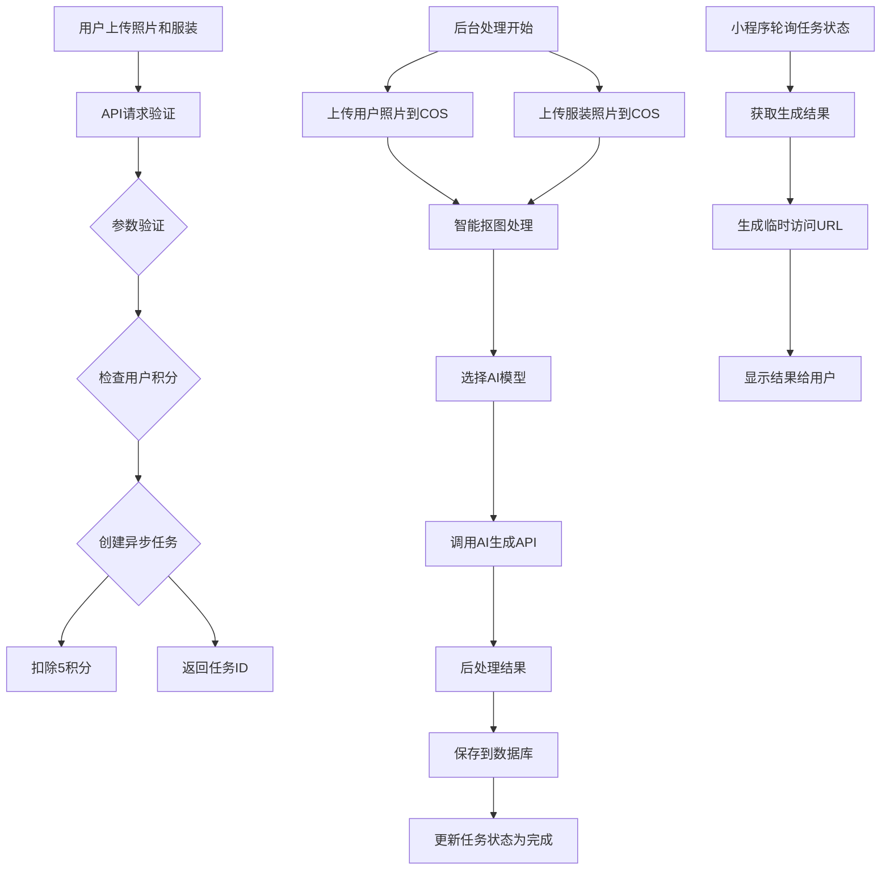
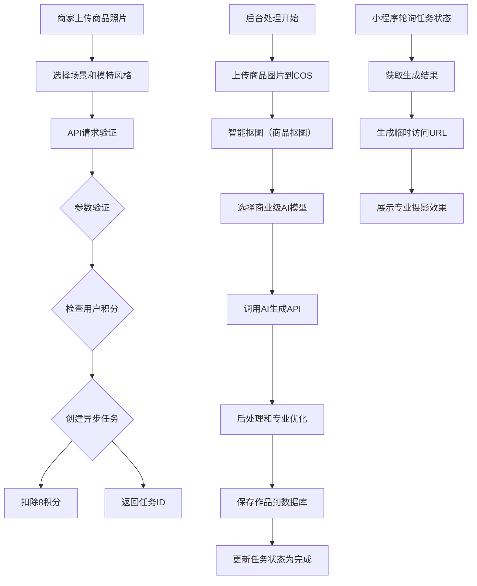
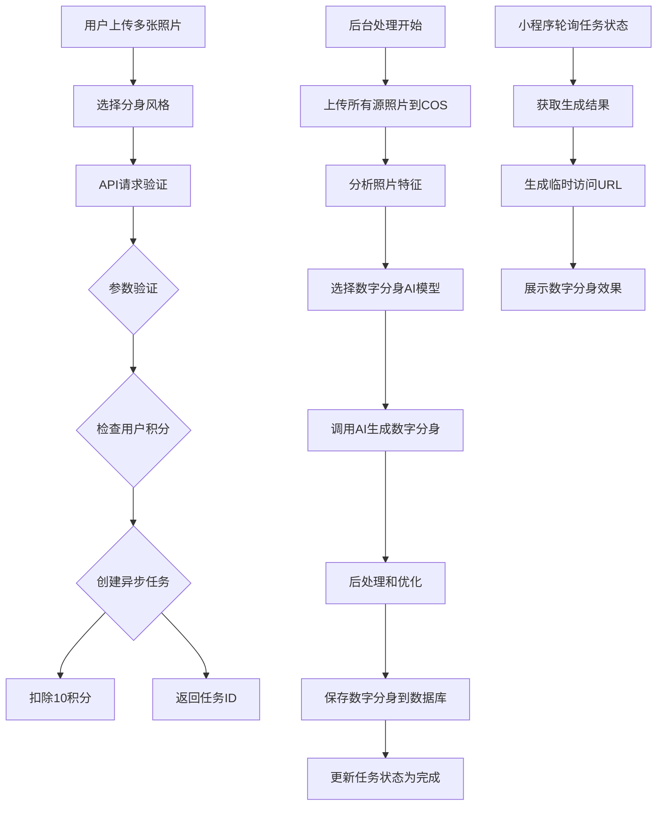
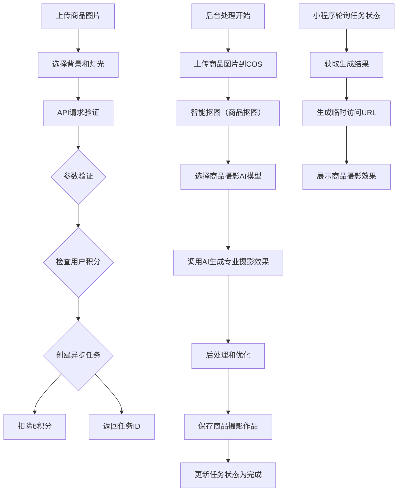

# 🎨 AI图片生成完整流程图

> 📅 基于你的项目研究，理清虚拟试衣、时尚摄影、数字分身的完整生成流程

## 📋 概览

本系统支持4种AI图片生成类型，采用异步任务队列处理机制，确保用户体验流畅。

### 🎯 生成类型
1. **虚拟试衣** - 用户照片 + 服装照片 → 试衣效果
2. **时尚摄影** - 商品照片 → 专业摄影效果
3. **数字分身** - 多张照片 → 数字人模型
4. **商品摄影** - 商品图片 → 商品展示效果

### 🏗️ 技术架构
```
小程序前端 → API网关 → AI生成服务 → 任务队列 → 后台处理
     ↓              ↓             ↓             ↓            ↓
   HTTP请求 → 用户验证 → 参数验证 → 积分检查 → 创建任务
     ↓              ↓             ↓             ↓            ↓
   响应返回  ← 任务ID     ← 立即返回 ← 预估时间
```

## 🔄 完整生图流程

### 🎯 虚拟试衣流程



**详细步骤：**
1. **前端请求**：用户上传人物照片和服装照片
2. **API验证**：验证用户身份和输入参数
3. **积分检查**：检查用户积分类（虚拟试衣=5积分）
4. **创建任务**：生成唯一任务ID，记录到数据库
5. **扣除积分**：立即扣除相应积分
6. **异步处理**：后台处理开始
   - 上传图片到腾讯云COS
   - 调用数据万象智能抠图（人像抠图）
   - 选择最优AI模型（Gemini 2.0优先）
   - 调用AI生成API
   - 后处理结果
   - 保存作品到数据库
7. **状态更新**：任务状态变更为"completed"
8. **结果获取**：前端轮询获取任务结果
9. **URL生成**：为结果图片生成临时访问URL
10. **展示结果**：在小程序中展示生成效果

### 🎯 时尚摄影流程



**商业版优化：**
- **AI模型优先级**：Seedream 4.0 > Gemini 2.0 > GPT-4 Vision
- **抠图类型**：专门使用商品抠图
- **质量设置**：默认high质量
- **场景支持**：支持多种专业摄影场景
- **成本**：8积分/次（比个人版高）

### 🎯 数字分身流程



**数字分身特点：**
- **输入**：需要多张照片（最少1张）
- **AI模型**：Gemini 2.0优先
- **处理时间**：60秒（最长）
- **成本**：10积分/次（最贵）
- **输出**：高质量的数字人模型

### 🎯 商品摄影流程



**商品摄影特点：**
- **抠图类型**：商品抠图
- **输出格式**：专业商品摄影效果
- **处理时间**：25秒（最快）
- **成本**：6积分/次

## 🔄 任务状态管理

### 📊 任务状态流转
```
pending → processing → completed
  ↓           ↓              ↓
  ↓           ↓              ↓
  ↓           ↓              ↓
cancelled  failed       (最终状态)
```

### 📋 状态详细说明

| 状态 | 说明 | 用户操作 |
|------|------|----------|
| **pending** | 任务已创建，等待处理 | 用户可以取消任务 |
| **processing** | 正在后台处理中 | 显示进度，无法取消 |
| **completed** | 生成完成，可获取结果 | 可下载或分享 |
| **cancelled** | 用户主动取消 | 积分已退还 |
| **failed** | 处理失败 | 积分已退还 |

### 📈 进度跟踪
```
10% - 开始处理图片...
30% - 图片处理完成，开始AI生成...
50% - 开始虚拟试衣生成...
80% - AI生成完成，后处理中...
100% - 完成
```

## 💰 积分系统

### 💎 积分消耗标准
```json
{
  "virtual_tryon": 5,
  "fashion_photo": 8,
  "digital_avatar": 10,
  "product_photo": 6
}
```

### 🎁 积分来源
- **新用户注册**：赠送10积分
- **积分充值**：不同套餐不同积分
- **任务失败退还**：失败自动退还
- **订阅用户**：高级功能免费或打折

### 💳 积分使用记录
```javascript
{
  "_id": "credit_001",
  "openid": "user_openid",
  "type": "spend",
  "amount": -5,
  "description": "虚拟试衣生成",
  "createdAt": "2024-01-20T10:30:00.000Z"
}
```

## 🤖 AI模型选择策略

### 🎯 个人版AI路由优先级
```
1. Gemini 2.0（高性价比）
2. Seedream Lite（成本优化）
3. DeepSeek Vision（备选）
4. GPT-3.5 Turbo Vision（免费）
```

### 🎯 商业版AI路由优先级
```
1. Seedream 4.0（专业效果）
2. Gemini 2.0（高质量）
3. GPT-4 Vision（兜底）
```

### 🎯 智能路由因素
- **质量要求**：用户设置的质量等级
- **成本考虑**：用户订阅类型
- **历史性能**：模型成功率和响应时间
- **可用性**：当前模型服务状态

## 📸 数据存储结构

### 👤 用户表 (users)
```javascript
{
  "_id": "user_id",
  "openid": "wechat_openid",
  "nickName": "用户昵称",
  "avatarUrl": "头像URL",
  "credits": {
    "balance": 85,
    "totalEarned": 200,
    "totalSpent": 115,
    "lastUpdated": "2024-01-20T10:30:00.000Z"
  },
  "subscription": {
    "type": "premium",
    "startDate": "2024-01-20T00:00:00.000Z",
    "endDate": "2024-04-20T00:00:00.000Z",
    "features": ["unlimited_generation", "priority_processing"]
  },
  "settings": {
    "notifications": true,
    "autoSave": true,
    "quality": "high",
    "language": "zh-CN"
  },
  "statistics": {
    "worksCreated": 25,
    "worksShared": 18,
    "totalGenerationTime": 3600,
    "favoriteCount": 45
  }
}
```

### 🎯 任务队列表 (task_queue)
```javascript
{
  "_id": "task_id",
  "openid": "user_openid",
  "type": "virtual_tryon",
  "status": "completed",
  "progress": 100,
  "input": {
    "personImage": "base64_image_data",
    "clothingImage": "base64_image_data",
    "settings": {
      "quality": "high",
      "style": "natural"
    }
  },
  "result": {
    "images": [
      {
        "cloudPath": "results/virtual_tryon/16421234567890.jpg",
        "fileName": "result.jpg",
        "size": 1024*500,
        "format": "jpg"
      }
    ],
    "aiModel": "gemini-2.0",
    "processingTime": 32000
  },
  "credits": 5,
  "createdAt": "2024-01-20T10:30:00.000Z",
  "updatedAt": "2024-01-20T10:30:30.000Z",
  "completedAt": "2024-01-20T10:30:30.000Z"
}
```

### 🖼️ 作品表 (works)
```javascript
{
  "_id": "work_id",
  "openid": "user_openid",
  "type": "virtual_tryon",
  "title": "虚拟试衣作品",
  "input": "同任务表input字段",
  "result": "同任务表result字段",
  "settings": "用户设置",
  "isPublic": false,
  "favoriteCount": 0,
  "tags": ["试衣", "虚拟试衣"],
  "createdAt": "2024-01-20T10:30:00.000Z"
}
```

## 🔧 错误处理机制

### ⚠️ 错误类型
1. **积分不足** - 提示充值，阻止创建任务
2. **AI服务异常** - 3次重试机制，失败后退款
3. **存储失败** - 检查COS配置和权限
4. **用户认证失败** - 检查JWT配置和用户状态

### 🔄 重试策略
- **最大重试次数**：3次
- **重试延迟**：5秒递增
- **重试条件**：AI服务调用失败
- **失败处理**：记录错误并退款

### 📊 监控指标
- **成功率**：各AI模型的成功率统计
- **平均处理时间**：不同生成类型的平均时间
- **用户满意度**：基于用户反馈和退款率
- **成本控制**：积分使用情况统计

## 🚀 性能优化

### ⚡ 优化策略
1. **预分配函数**：减少冷启动延迟
2. **任务队列**：异步处理提高响应速度
3. **缓存机制**：AI模型结果缓存（相同输入直接返回）
4. **并发控制**：避免过度消耗资源

### 📈 性能监控
- **函数调用次数**：API调用频率统计
- **响应时间**：P50、P90、P99
- **错误率**：服务稳定性监控
- **成本统计**：实时成本跟踪

---

## 📋 总结

这套AI生图系统具备以下核心优势：

✅ **完整的功能覆盖**：支持4种生成类型
✅ **异步处理机制**：用户体验流畅，无需等待
✅ **智能AI路由**：根据业务模式选择最优模型
✅ **积分系统**：灵活的成本控制
✅ **任务管理**：完整的状态跟踪和错误处理
✅ **数据万象集成**：专业的图片处理能力
✅ **双模式支持**：个人版和商业版差异化功能

整个流程经过精心设计，确保用户能够快速、稳定地生成高质量的AI图片内容！🎨